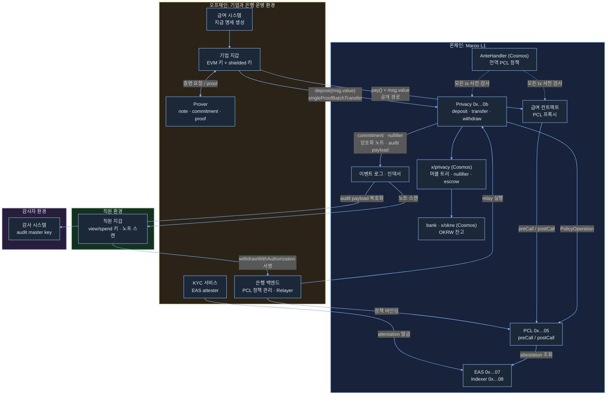

범례
- 실선: 마루 문서 기준 호출 경로. 굵은 표시 없음.
- 점선: 트랜잭션이 EVM에 닿기 전 단계(AnteHandler).
- 직접 검증한 것: Privacy → x/privacy 내부 동작(로컬 Clairveil), PCL 프록시 → PCL 정책 평가(테스트넷), EAS 주소 조회(테스트넷).
- 문서로만 확인한 것: Privacy → PCL PolicyOperation 연동, withdrawWithAuthorization relay 경로.
- 제안: 은행이 Relayer와 PCL admin을 함께 운영하는 배치. 마루가 강제하는 구조가 아님.
