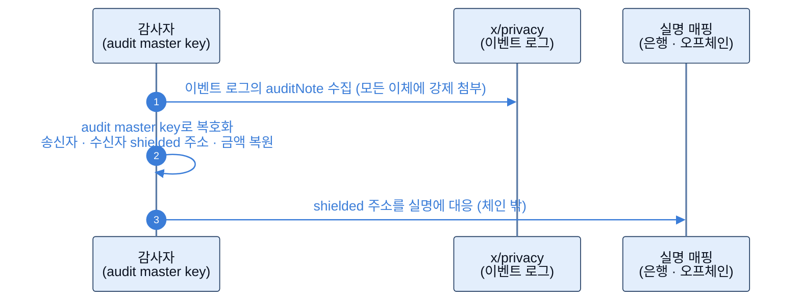

```mermaid
%%{init: {'theme': 'base', 'themeVariables': {'fontSize': '16px', 'primaryColor': '#ffffff', 'primaryTextColor': '#0b1220', 'primaryBorderColor': '#1f3a5f', 'secondaryColor': '#e3eefc', 'tertiaryColor': '#fff4d6', 'lineColor': '#3b7dd8', 'textColor': '#0b1220', 'edgeLabelBackground': '#ffffff', 'clusterBkg': '#eef3fa', 'clusterBorder': '#5b7ba6', 'titleColor': '#0b1220', 'actorBkg': '#e3eefc', 'actorBorder': '#1f3a5f', 'actorTextColor': '#0b1220', 'actorLineColor': '#5b7ba6', 'signalColor': '#3b7dd8', 'signalTextColor': '#3b7dd8', 'noteBkgColor': '#fff4d6', 'noteBorderColor': '#b7791f', 'noteTextColor': '#0b1220', 'labelBoxBkgColor': '#e3eefc', 'labelBoxBorderColor': '#1f3a5f', 'labelTextColor': '#0b1220', 'loopTextColor': '#0b1220', 'sequenceNumberColor': '#ffffff', 'activationBkgColor': '#fff4d6'}}}%%
sequenceDiagram
  autonumber
  participant AUD as 감사자<br/>(audit master key)
  participant XP as x/privacy<br/>(이벤트 로그)
  participant REG as 실명 매핑<br/>(은행 · 오프체인)

  AUD->>XP: 이벤트 로그의 auditNote 수집 (모든 이체에 강제 첨부)
  AUD->>AUD: audit master key로 복호화<br/>송신자 · 수신자 shielded 주소 · 금액 복원
  AUD->>REG: shielded 주소를 실명에 대응 (체인 밖)
```
