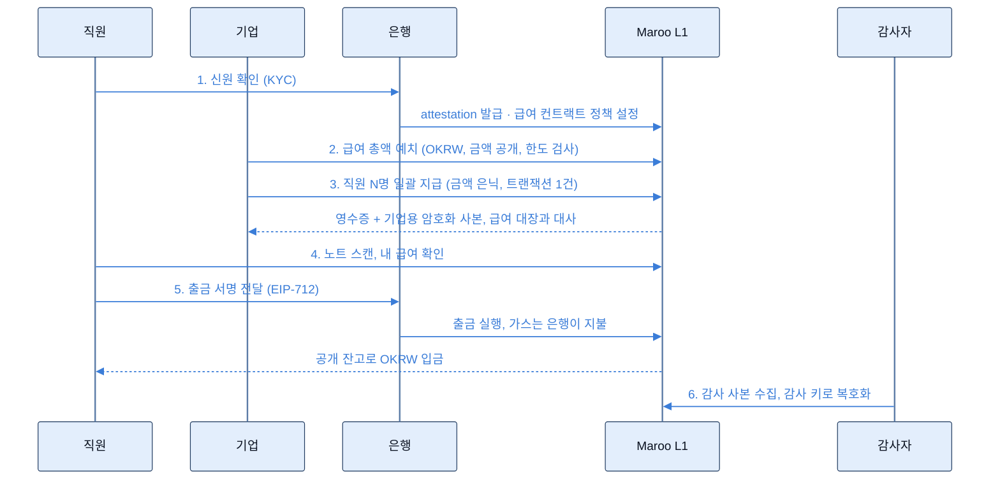

```mermaid
%%{init: {'theme': 'base', 'themeVariables': {'fontSize': '16px', 'primaryColor': '#ffffff', 'primaryTextColor': '#0b1220', 'primaryBorderColor': '#1f3a5f', 'secondaryColor': '#e3eefc', 'tertiaryColor': '#fff4d6', 'lineColor': '#3b7dd8', 'textColor': '#0b1220', 'edgeLabelBackground': '#ffffff', 'clusterBkg': '#eef3fa', 'clusterBorder': '#5b7ba6', 'titleColor': '#0b1220', 'actorBkg': '#e3eefc', 'actorBorder': '#1f3a5f', 'actorTextColor': '#0b1220', 'actorLineColor': '#5b7ba6', 'signalColor': '#3b7dd8', 'signalTextColor': '#3b7dd8', 'noteBkgColor': '#fff4d6', 'noteBorderColor': '#b7791f', 'noteTextColor': '#0b1220', 'labelBoxBkgColor': '#e3eefc', 'labelBoxBorderColor': '#1f3a5f', 'labelTextColor': '#0b1220', 'loopTextColor': '#0b1220', 'sequenceNumberColor': '#ffffff', 'activationBkgColor': '#fff4d6'}}}%%
sequenceDiagram
  participant EMP as 직원
  participant CORP as 기업
  participant BANK as 은행
  participant CHAIN as Maroo L1
  participant AUD as 감사자

  EMP->>BANK: 1. 신원 확인 (KYC)
  BANK->>CHAIN: attestation 발급 · 급여 컨트랙트 정책 설정
  CORP->>CHAIN: 2. 급여 총액 예치 (OKRW, 금액 공개, 한도 검사)
  CORP->>CHAIN: 3. 직원 N명 일괄 지급 (금액 은닉, 트랜잭션 1건)
  CHAIN-->>CORP: 영수증 + 기업용 암호화 사본, 급여 대장과 대사
  EMP->>CHAIN: 4. 노트 스캔, 내 급여 확인
  EMP->>BANK: 5. 출금 서명 전달 (EIP-712)
  BANK->>CHAIN: 출금 실행, 가스는 은행이 지불
  CHAIN-->>EMP: 공개 잔고로 OKRW 입금
  AUD->>CHAIN: 6. 감사 사본 수집, 감사 키로 복호화
```
