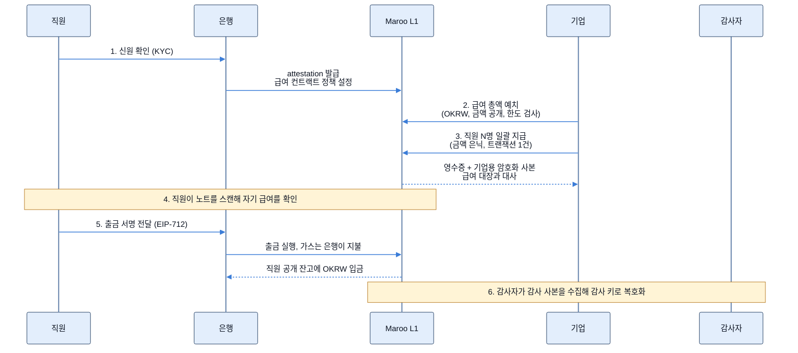

```mermaid
%%{init: {'theme': 'base', 'themeVariables': {'fontSize': '16px', 'primaryColor': '#ffffff', 'primaryTextColor': '#0b1220', 'primaryBorderColor': '#1f3a5f', 'lineColor': '#3b7dd8', 'textColor': '#0b1220', 'actorBkg': '#e3eefc', 'actorBorder': '#1f3a5f', 'actorTextColor': '#0b1220', 'actorLineColor': '#5b7ba6', 'signalColor': '#3b7dd8', 'signalTextColor': '#0b1220', 'noteBkgColor': '#fff4d6', 'noteBorderColor': '#b7791f', 'noteTextColor': '#0b1220', 'sequenceNumberColor': '#ffffff'}, 'sequence': {'actorMargin': 140, 'width': 130, 'messageMargin': 40, 'noteMargin': 12}}}%%
sequenceDiagram
  participant EMP as 직원
  participant BANK as 은행
  participant CHAIN as Maroo L1
  participant CORP as 기업
  participant AUD as 감사자

  EMP->>BANK: 1. 신원 확인 (KYC)
  BANK->>CHAIN: attestation 발급<br/>급여 컨트랙트 정책 설정
  CORP->>CHAIN: 2. 급여 총액 예치<br/>(OKRW, 금액 공개, 한도 검사)
  CORP->>CHAIN: 3. 직원 N명 일괄 지급<br/>(금액 은닉, 트랜잭션 1건)
  CHAIN-->>CORP: 영수증 + 기업용 암호화 사본<br/>급여 대장과 대사
  Note over EMP,CHAIN: 4. 직원이 노트를 스캔해 자기 급여를 확인
  EMP->>BANK: 5. 출금 서명 전달 (EIP-712)
  BANK->>CHAIN: 출금 실행, 가스는 은행이 지불
  CHAIN-->>BANK: 직원 공개 잔고에 OKRW 입금
  Note over CHAIN,AUD: 6. 감사자가 감사 사본을 수집해 감사 키로 복호화
```
