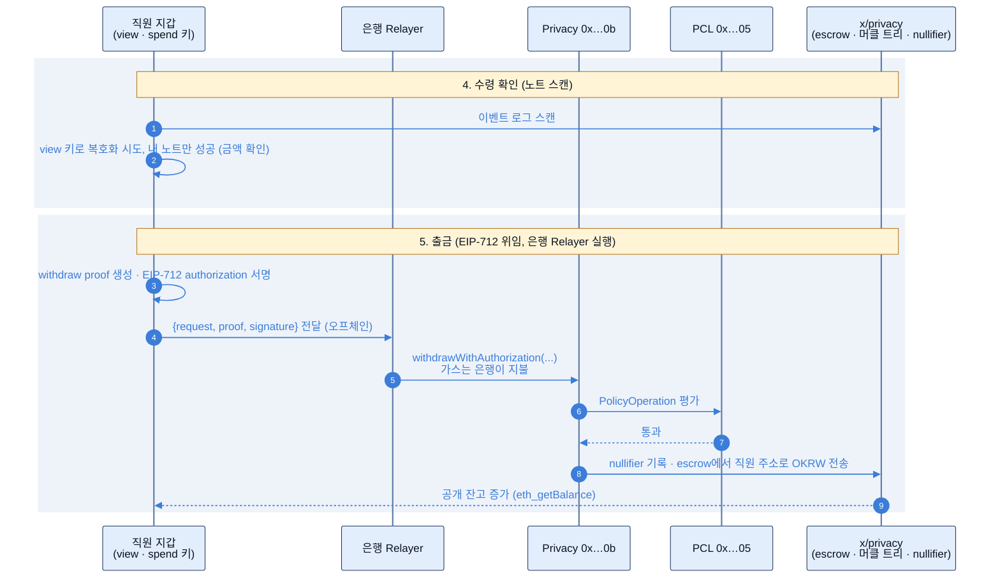

```mermaid
%%{init: {'theme': 'base', 'themeVariables': {'fontSize': '16px', 'primaryColor': '#ffffff', 'primaryTextColor': '#0b1220', 'primaryBorderColor': '#1f3a5f', 'secondaryColor': '#e3eefc', 'tertiaryColor': '#fff4d6', 'lineColor': '#3b7dd8', 'textColor': '#0b1220', 'edgeLabelBackground': '#ffffff', 'clusterBkg': '#eef3fa', 'clusterBorder': '#5b7ba6', 'titleColor': '#0b1220', 'actorBkg': '#e3eefc', 'actorBorder': '#1f3a5f', 'actorTextColor': '#0b1220', 'actorLineColor': '#5b7ba6', 'signalColor': '#3b7dd8', 'signalTextColor': '#3b7dd8', 'noteBkgColor': '#fff4d6', 'noteBorderColor': '#b7791f', 'noteTextColor': '#0b1220', 'labelBoxBkgColor': '#e3eefc', 'labelBoxBorderColor': '#1f3a5f', 'labelTextColor': '#0b1220', 'loopTextColor': '#0b1220', 'sequenceNumberColor': '#ffffff', 'activationBkgColor': '#fff4d6'}}}%%
sequenceDiagram
  autonumber
  participant EMP as 직원 지갑<br/>(view · spend 키)
  participant BANK as 은행 Relayer
  participant PRIV as Privacy 0x…0b
  participant PCL as PCL 0x…05
  participant XP as x/privacy<br/>(escrow · 머클 트리 · nullifier)

  rect rgb(238, 243, 250)
    Note over EMP,XP: 4. 수령 확인 (노트 스캔)
    EMP->>XP: 이벤트 로그 스캔
    EMP->>EMP: view 키로 복호화 시도, 내 노트만 성공 (금액 확인)
  end

  rect rgb(238, 243, 250)
    Note over EMP,XP: 5. 출금 (EIP-712 위임, 은행 Relayer 실행)
    EMP->>EMP: withdraw proof 생성 · EIP-712 authorization 서명
    EMP->>BANK: {request, proof, signature} 전달 (오프체인)
    BANK->>PRIV: withdrawWithAuthorization(...)<br/>가스는 은행이 지불
    PRIV->>PCL: PolicyOperation 평가
    PCL-->>PRIV: 통과
    PRIV->>XP: nullifier 기록 · escrow에서 직원 주소로 OKRW 전송
    XP-->>EMP: 공개 잔고 증가 (eth_getBalance)
  end
```
