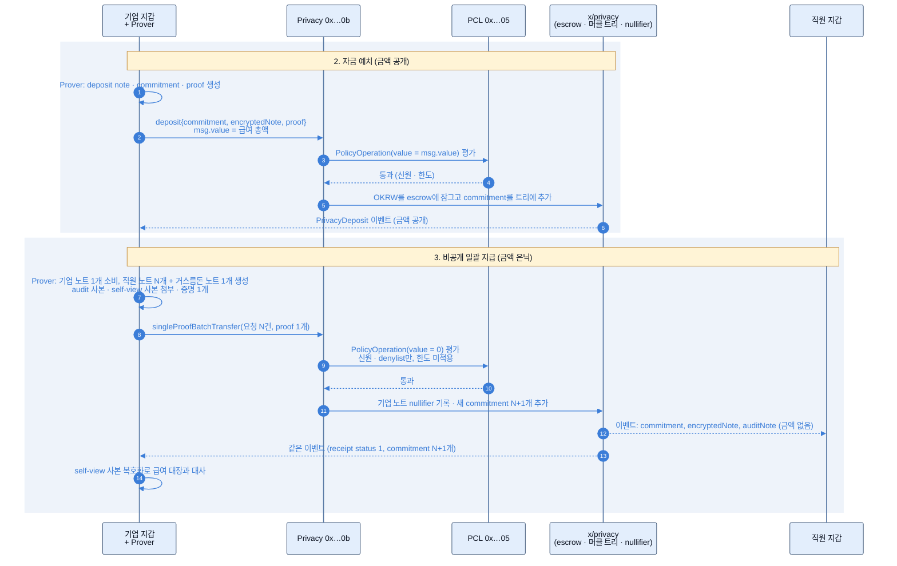
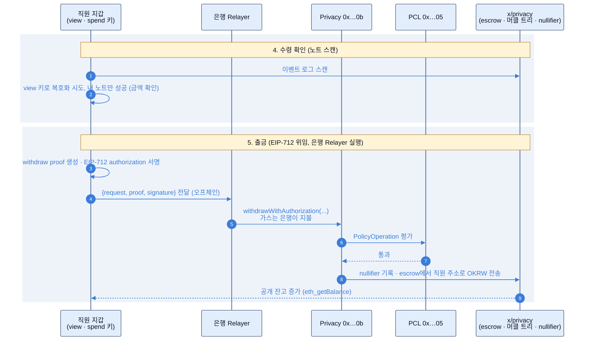
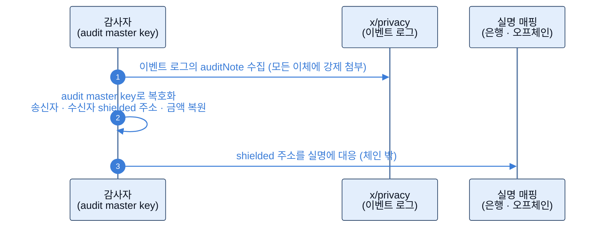

# 급여 지급 과정 상세 시퀀스

가이드 4장의 전체 흐름 다이어그램을 프리컴파일 단위까지 내린 것이다. 본문 분량을 위해 여기로 옮겼다.

## 4.3 예치와 비공개 지급

```mermaid
%%{init: {'theme': 'base', 'themeVariables': {'fontSize': '16px', 'primaryColor': '#ffffff', 'primaryTextColor': '#0b1220', 'primaryBorderColor': '#1f3a5f', 'secondaryColor': '#e3eefc', 'tertiaryColor': '#fff4d6', 'lineColor': '#3b7dd8', 'textColor': '#0b1220', 'edgeLabelBackground': '#ffffff', 'clusterBkg': '#eef3fa', 'clusterBorder': '#5b7ba6', 'titleColor': '#0b1220', 'actorBkg': '#e3eefc', 'actorBorder': '#1f3a5f', 'actorTextColor': '#0b1220', 'actorLineColor': '#5b7ba6', 'signalColor': '#3b7dd8', 'signalTextColor': '#3b7dd8', 'noteBkgColor': '#fff4d6', 'noteBorderColor': '#b7791f', 'noteTextColor': '#0b1220', 'labelBoxBkgColor': '#e3eefc', 'labelBoxBorderColor': '#1f3a5f', 'labelTextColor': '#0b1220', 'loopTextColor': '#0b1220', 'sequenceNumberColor': '#ffffff', 'activationBkgColor': '#fff4d6'}}}%%
sequenceDiagram
  autonumber
  participant CORP as 기업 지갑<br/>+ Prover
  participant PRIV as Privacy 0x…0b
  participant PCL as PCL 0x…05
  participant XP as x/privacy<br/>(escrow · 머클 트리 · nullifier)
  participant EMP as 직원 지갑

  rect rgb(238, 243, 250)
    Note over CORP,XP: 2. 자금 예치 (금액 공개)
    CORP->>CORP: Prover: deposit note · commitment · proof 생성
    CORP->>PRIV: deposit{commitment, encryptedNote, proof}<br/>msg.value = 급여 총액
    PRIV->>PCL: PolicyOperation(value = msg.value) 평가
    PCL-->>PRIV: 통과 (신원 · 한도)
    PRIV->>XP: OKRW를 escrow에 잠그고 commitment를 트리에 추가
    XP-->>CORP: PrivacyDeposit 이벤트 (금액 공개)
  end

  rect rgb(238, 243, 250)
    Note over CORP,EMP: 3. 비공개 일괄 지급 (금액 은닉)
    CORP->>CORP: Prover: 기업 노트 1개 소비, 직원 노트 N개 + 거스름돈 노트 1개 생성<br/>audit 사본 · self-view 사본 첨부 · 증명 1개
    CORP->>PRIV: singleProofBatchTransfer(요청 N건, proof 1개)
    PRIV->>PCL: PolicyOperation(value = 0) 평가<br/>신원 · denylist만, 한도 미적용
    PCL-->>PRIV: 통과
    PRIV->>XP: 기업 노트 nullifier 기록 · 새 commitment N+1개 추가
    XP-->>EMP: 이벤트: commitment, encryptedNote, auditNote (금액 없음)
    XP-->>CORP: 같은 이벤트 (receipt status 1, commitment N+1개)
    CORP->>CORP: self-view 사본 복호화로 급여 대장과 대사
  end
```

## 4.4 수령과 출금

```mermaid
%%{init: {'theme': 'base', 'themeVariables': {'fontSize': '16px', 'primaryColor': '#ffffff', 'primaryTextColor': '#0b1220', 'primaryBorderColor': '#1f3a5f', 'secondaryColor': '#e3eefc', 'tertiaryColor': '#fff4d6', 'lineColor': '#3b7dd8', 'textColor': '#0b1220', 'edgeLabelBackground': '#ffffff', 'clusterBkg': '#eef3fa', 'clusterBorder': '#5b7ba6', 'titleColor': '#0b1220', 'actorBkg': '#e3eefc', 'actorBorder': '#1f3a5f', 'actorTextColor': '#0b1220', 'actorLineColor': '#5b7ba6', 'signalColor': '#3b7dd8', 'signalTextColor': '#3b7dd8', 'noteBkgColor': '#fff4d6', 'noteBorderColor': '#b7791f', 'noteTextColor': '#0b1220', 'labelBoxBkgColor': '#e3eefc', 'labelBoxBorderColor': '#1f3a5f', 'labelTextColor': '#0b1220', 'loopTextColor': '#0b1220', 'sequenceNumberColor': '#ffffff', 'activationBkgColor': '#fff4d6'}}}%%
sequenceDiagram
  autonumber
  participant EMP as 직원 지갑<br/>(view · spend 키)
  participant BANK as 은행 Relayer
  participant PRIV as Privacy 0x…0b
  participant PCL as PCL 0x…05
  participant XP as x/privacy<br/>(escrow · 머클 트리 · nullifier)

  rect rgb(238, 243, 250)
    Note over EMP,XP: 4. 수령 확인 (노트 스캔)
    EMP->>XP: 이벤트 로그 스캔
    EMP->>EMP: view 키로 복호화 시도, 내 노트만 성공 (금액 확인)
  end

  rect rgb(238, 243, 250)
    Note over EMP,XP: 5. 출금 (EIP-712 위임, 은행 Relayer 실행)
    EMP->>EMP: withdraw proof 생성 · EIP-712 authorization 서명
    EMP->>BANK: {request, proof, signature} 전달 (오프체인)
    BANK->>PRIV: withdrawWithAuthorization(...)<br/>가스는 은행이 지불
    PRIV->>PCL: PolicyOperation 평가
    PCL-->>PRIV: 통과
    PRIV->>XP: nullifier 기록 · escrow에서 직원 주소로 OKRW 전송
    XP-->>EMP: 공개 잔고 증가 (eth_getBalance)
  end
```

## 4.5 감사

```mermaid
%%{init: {'theme': 'base', 'themeVariables': {'fontSize': '16px', 'primaryColor': '#ffffff', 'primaryTextColor': '#0b1220', 'primaryBorderColor': '#1f3a5f', 'secondaryColor': '#e3eefc', 'tertiaryColor': '#fff4d6', 'lineColor': '#3b7dd8', 'textColor': '#0b1220', 'edgeLabelBackground': '#ffffff', 'clusterBkg': '#eef3fa', 'clusterBorder': '#5b7ba6', 'titleColor': '#0b1220', 'actorBkg': '#e3eefc', 'actorBorder': '#1f3a5f', 'actorTextColor': '#0b1220', 'actorLineColor': '#5b7ba6', 'signalColor': '#3b7dd8', 'signalTextColor': '#3b7dd8', 'noteBkgColor': '#fff4d6', 'noteBorderColor': '#b7791f', 'noteTextColor': '#0b1220', 'labelBoxBkgColor': '#e3eefc', 'labelBoxBorderColor': '#1f3a5f', 'labelTextColor': '#0b1220', 'loopTextColor': '#0b1220', 'sequenceNumberColor': '#ffffff', 'activationBkgColor': '#fff4d6'}}}%%
sequenceDiagram
  autonumber
  participant AUD as 감사자<br/>(audit master key)
  participant XP as x/privacy<br/>(이벤트 로그)
  participant REG as 실명 매핑<br/>(은행 · 오프체인)

  AUD->>XP: 이벤트 로그의 auditNote 수집 (모든 이체에 강제 첨부)
  AUD->>AUD: audit master key로 복호화<br/>송신자 · 수신자 shielded 주소 · 금액 복원
  AUD->>REG: shielded 주소를 실명에 대응 (체인 밖)
```
