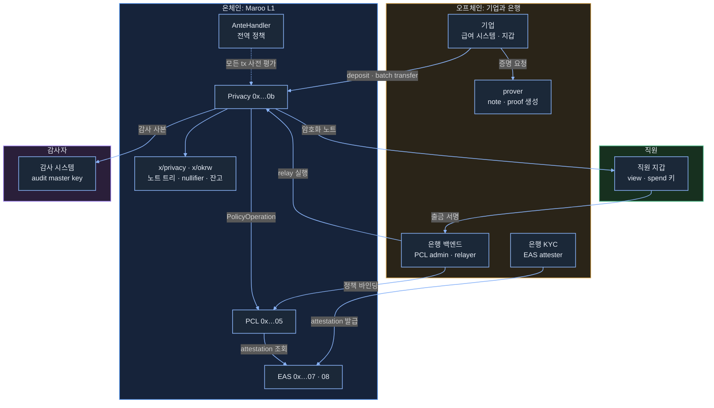
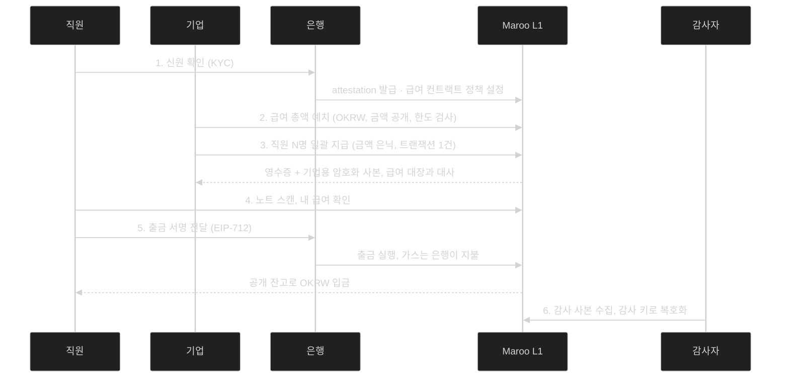
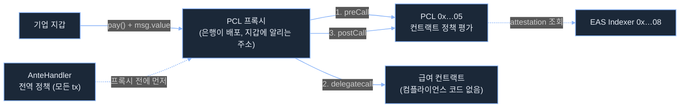
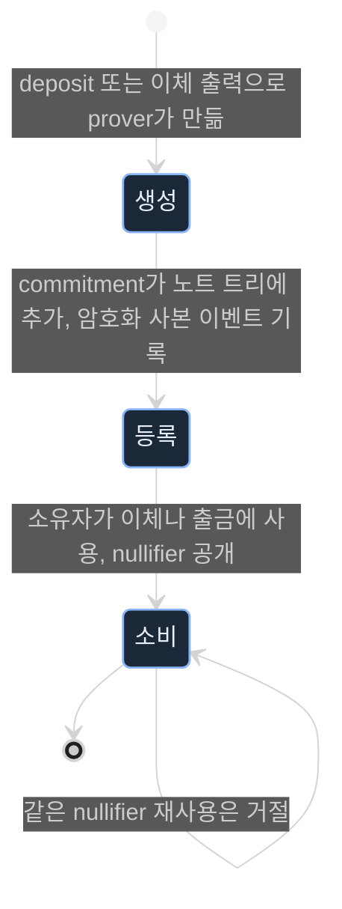

# Maroo 기관 통합 가이드

## 1. 이 문서가 다루는 것

이 문서는 기업 고객에게 급여 지급 서비스를 제공하려는 은행 플랫폼 팀의 시니어 엔지니어를 위해 작성 되었다. EVM, Solidity, TypeScript, JSON-RPC는 익숙하지만 마루와 ZK 프라이버시는 처음 접한다고 가정한다. 증권사나 지급 사업자의 엔지니어도 이 문서를 읽고 온보딩할 수 있다.

읽고 나면 다음을 결정할 수 있다.

- 마루가 제공하는 것과 은행이 직접 만들어야 하는 것의 경계
- 은행이 소유해야 하는 키와 운영해야 하는 서비스
- 누가 어떤 데이터를 보는지, 컴플라이언스 팀에 무엇을 설명할지
- PoC를 시작할 때 테스트넷에서 되는 것과 로컬에서만 되는 것

기업이 직원에게 급여를 지급하되 금액은 외부에 숨기고, 규제 정책은 통과하며, 감사자는 사후에 복원할 수 있는 사례를 바탕으로 개발 과정을 순서대로 설명한다.

사실의 출처를 네 가지로 구분한다. 아무 표시가 없는 서술은 docs.maroo.io에서 확인한 것이다. 직접 실행해 확인한 것은 날짜와 근거 위치를 같이 적는다. 마루가 npm에 공개한 패키지에서 읽은 것은 패키지 이름, 버전, 게시일을 같이 적는다. 문서에 없는 배치나 설계 판단은 제안이라고 쓴다. 근거 파일은 `evidence/` 폴더에, 따라 할 수 있는 예제는 `recipe/` 폴더에 있다. 주장별 구분은 [evidence/README.md](../evidence/README.md)의 표에 모았다.

## 2. 해결하려는 문제

기업이 직원 급여를 온체인으로 지급하려 할 때 은행은 세 가지 문제에 부딪힌다.

첫째, 금액 노출. 공개 체인에서는 보내는 주소, 받는 주소, 금액이 누구에게나 보인다. 급여는 개인정보이고, 지급 주소 목록과 금액을 합치면 기업의 인건비 구조가 드러난다. 지급마다 주소를 바꿔도 자금 흐름을 따라가면 다시 연결된다.

둘째, 규제 증빙. 지급 전에는 수취인 신원 확인과 한도 검사가 트랜잭션마다 강제돼야 하고, 지급 후에는 감사자가 누가 누구에게 얼마를 보냈는지 복원할 수 있어야 한다. 금액을 숨기는 순간 이 두 요구는 프라이버시와 충돌한다. 검사 로직을 지급 컨트랙트마다 직접 짜면 정책이 컨트랙트별로 갈라지고, 규정이 바뀔 때마다 재배포가 필요하다.

셋째, 정산 비용. 원화 스테이블코인 토큰을 쓰면 원화 계정과 토큰 사이에 환전 단계와 이중 장부가 생긴다. 직원 수백 명에게 한 건씩 보내면 트랜잭션 수와 가스가 인원에 비례하고, 직원은 받은 돈을 꺼내기 위해 가스용 자산을 먼저 확보해야 한다.

마루는 이 셋을 체인에 내장된 기능 세 개로 나눠 해결한다. 금액 노출은 Privacy 프리컴파일이 해결한다. 기업이 OKRW를 비공개 풀에 넣으면 이후 이체는 금액과 수취인이 암호화된 노트 단위로 기록되고, 직원 여러 명분 지급이 트랜잭션 한 건, 증명 한 개로 끝난다. 규제 증빙은 둘로 나뉜다. 지급 전 검사는 PCL(Programmable Compliance Layer)이 맡는다. 신원 확인과 한도 정책이 컨트랙트 코드가 아니라 체인 레벨에 등록되므로 지급 컨트랙트를 다시 배포하지 않고 정책을 바꿀 수 있다. 지급 후 복원은 Privacy 프리컴파일이 맡는다. 비공개 이체마다 감사 키로 암호화된 사본이 강제로 붙어 감사자만 사후에 복원한다. 정산 비용은 OKRW가 해결한다. 원화에 1:1로 고정되도록 설계된 네이티브 통화라 별도 토큰 컨트랙트와 환전 단계가 없고, 직원의 출금은 EIP-712 서명을 받아 은행이 대신 실행할 수 있게 설계되어 있어(문서 기준) 직원이 가스를 준비할 필요가 없다. 이 문서는 이 세 기능을 급여 지급 한 흐름 안에서 이어 붙이는 방법을 다룬다.

## 3. 마루가 제공하는 것

마루는 EVM 호환 L1이다. 실행 계층은 Ethereum과 같은 JSON-RPC와 Solidity를 쓰고, 그 아래는 Cosmos SDK다. 기관용 기능은 프리컴파일로 제공된다. 프리컴파일은 노드 안에 네이티브 코드로 구현되어 고정 주소에 노출되는 함수 집합이라, 주소에 바이트코드가 없어 `eth_getCode`는 `0x`를 돌려주지만 호출하면 데이터나 revert로 답한다. 프리컴파일 뒤에서 상태를 갖는 것은 Cosmos 모듈이며, 이 문서에서 `x/privacy`처럼 `x/`가 붙은 이름은 모두 Cosmos 모듈이다. 모듈이 다루는 자산 단위 이름은 denom이라 부른다.

이 가이드는 테스트넷 기준이다. 메인넷은 문서 기준 chainId 815이고 RPC는 `rpc.maroo.io` 패턴이지만, 2026년 9월 3일 기준 그 호스트가 DNS에서 풀리지 않았다.

| 항목       | 테스트넷                            |
| ---------- | ----------------------------------- |
| chainId    | 450815                              |
| RPC        | `https://rpc-testnet.maroo.io`      |
| 익스플로러 | `https://explorer-testnet.maroo.io` |
| faucet     | `https://faucet.maroo.io`           |

### 세 가지 primitive

| primitive                           | 주소                                                                                                                            | 급여 지급 과정에서 하는 일                                                                                  | 이 가이드의 검증                                                                                                             |
| ----------------------------------- | ------------------------------------------------------------------------------------------------------------------------------- | ----------------------------------------------------------------------------------------------------------- | ---------------------------------------------------------------------------------------------------------------------------- |
| OKRW                                | IOkrw `0x1000…0001` (`mint`, `getParams`)                                                                                       | 급여 재원. 네이티브 통화라 잔고와 전송은 ETH와 같고 가스도 이것으로 낸다                                    | 테스트넷 직접 검증                                                                                                           |
| PCL (Programmable Compliance Layer) | `0x1000…0005`                                                                                                                   | 급여 컨트랙트 호출 직전과 직후에 신원과 한도 정책을 평가한다. 정책은 컨트랙트 코드가 아니라 체인에 등록된다 | 테스트넷 직접 검증                                                                                                           |
| Privacy                             | `0x1000…000b` (`deposit`, `transfer`, `withdraw`, 각각의 `WithAuthorization` 변형, `batchTransfer`, `singleProofBatchTransfer`) | OKRW를 비공개 풀에 넣고 금액과 수취인을 숨긴 채 지급한다. 모든 이체에 감사 키 사본이 붙는다                 | 프리컴파일 존재만 테스트넷 확인. 증명 생성 재료가 2026년 9월 3일 기준 미공개라 흐름은 참조 구현 Clairveil 로컬 체인에서 검증 |

보조 컴포넌트가 둘 있다. EAS는 어떤 주소가 KYC를 통과했다는 식의 서명된 주장(attestation)을 체인에 기록하는 컨트랙트로, 주소 `0x1000…0007`과 Indexer `0x1000…0008`은 EAS 프리컴파일 `0x1000…0009`의 `getParams`로 읽는다. PCL의 신원 정책이 이것을 참조한다. Clairveil은 `x/privacy`의 공개 참조 구현으로 DELIGHT LABS가 Apache-2.0으로 공개했으며, 이 가이드의 로컬 실습은 이 구현으로 한다.

### 아키텍처와 경계

호출 순서는 급여 지급 과정의 시퀀스 다이어그램에 있고, 상세 호출 경로는 [docs/diagrams/architecture.md](diagrams/architecture.md)에 있다.

| 경계     | 구성 요소                                                                                                                                        | 운영 주체        | 신뢰의 근거                                         |
| -------- | ------------------------------------------------------------------------------------------------------------------------------------------------ | ---------------- | --------------------------------------------------- |
| 온체인   | EVM 계층의 프리컴파일과 급여 컨트랙트. Cosmos 모듈 계층의 OKRW 잔고, 노트 트리, nullifier 집합, escrow. 그 앞단의 AnteHandler가 전역 정책을 적용 | 마루 밸리데이터  | 합의와 ZK 증명 검증                                 |
| 오프체인 | 기업 급여 시스템, 은행 백엔드(정책 관리, relayer)                                                                                                | 기업과 은행      | 마루가 제공하지 않는다. 은행이 만든다               |
| 지갑     | 트랜잭션용 EVM 키와 비공개 풀용 shielded 키 두 벌                                                                                                | 기업과 직원 각자 | 키 보관                                             |
| prover   | deposit과 이체마다 ZK 증명 생성. 금액과 수취인을 평문으로 다룬다                                                                                 | 기업 내부        | 가장 민감한 오프체인 컴포넌트. 외부에 두지 않는다   |
| auditor  | audit master key로 모든 이체 사본 복호화. 공개키는 제네시스 등록(문서 기준)                                                                      | 감사자           | 키 커스터디                                         |
| policy   | 급여 컨트랙트에 붙는 컨트랙트 정책은 은행이. 전역 정책과 Privacy 주소 정책은 마루 policyAdmin이                                                  | 은행과 마루      | 은행이 바꿀 수 있는 범위가 자기 컨트랙트뿐이라는 점 |

직접 검증한 경로는 Privacy와 `x/privacy` 내부 동작(로컬 Clairveil), PCL 프록시의 정책 평가와 EAS 주소 조회(테스트넷)다. Privacy 호출이 PCL에 PolicyOperation을 넘기는 연동과 relayer의 `withdrawWithAuthorization` 경로는 문서로만 확인했다. 은행이 relayer와 PCL admin을 함께 운영하는 배치는 이 가이드의 제안이다.

### 뒤에서 쓰는 용어

비공개 풀의 모든 상태 변경에는 ZK 증명이 붙는다. 증명은 금액과 주소를 드러내지 않은 채 세 가지를 체인에 약속한다. 소비하는 노트가 노트 트리에 실제로 있고 내가 그 spend 키를 가졌다는 것, 그 노트를 전에 쓴 적이 없다는 것, 입력 금액의 합이 출력 금액의 합과 같다는 것이다. 증명은 기업 쪽 prover가 평문을 보고 만들고, 체인은 검증키로 맞는지만 확인하므로 밸리데이터는 평문을 끝까지 모른다. 은행 입장에서 새로 관리할 것은 두 가지다. 평문을 다루는 prover의 위치와, 증명키와 검증키 파일(artifact)의 버전이다.

비공개 풀 안의 자산 단위는 노트다. 금액과 소유자가 암호화되어 있고, 체인의 노트 트리에는 노트의 해시인 commitment만 쌓인다. 노트를 쓸 때는 nullifier를 공개하며, 같은 노트를 두 번 쓰면 같은 값이 나와 거절된다. 노트는 EVM 주소와 별개인 shielded 주소로 받고, 자기 노트를 찾아 읽는 것은 view 키, 쓰는 것은 spend 키다. 이체마다 송신자, 수신자, 금액을 audit master key로 암호화한 감사 사본이 강제로 붙고, 송신자가 자기 키로 암호화해 붙이는 self-view 사본은 선택이며 기업의 급여 대장 대사에 쓴다. relayer는 사용자의 EIP-712 서명을 받아 대신 트랜잭션을 보내고 가스를 내는 서비스다.

## 4. 급여 지급 과정

급여 지급 과정은 여섯 단계다. 직원 신원 확인, 기업의 자금 예치, 비공개 일괄 지급, 직원의 수령 확인, 출금, 감사 순서다. 배당이나 정산 지급도 수취인 목록과 재원의 출처만 다를 뿐 이 여섯 단계가 같다.

2, 3, 4, 6단계는 로컬 Clairveil에서 직접 실행했고, 1단계와 5단계는 마루 문서를 근거로 구성한 제안이다. 프리컴파일 단위의 상세 시퀀스는 [docs/diagrams/privacy-sequence.md](diagrams/privacy-sequence.md)에 있다.

### 4.1 자금 준비 (OKRW)

기업이 급여 재원을 마루 계정에 준비하는 단계다. OKRW는 원화에 1:1로 고정되도록 설계된 네이티브 통화로, Ethereum에서 ETH가 있는 자리에 있다. 컨트랙트 없이 계정 잔고로 존재하고 가스도 OKRW로 낸다. ETH를 다루던 코드가 그대로 쓰인다.

- 잔고 조회: `eth_getBalance`. 전송: 트랜잭션의 `value`. 컨트랙트 자금 공급: `payable` 함수에 `msg.value`
- 단위: 18 decimals. denom은 `getParams` 응답을 쓴다
- 예제: [recipe/01-okrw](../recipe/01-okrw/README.md). 읽기 부분은 개인키 없이 실행된다

`getParams` 응답은 2026년 9월 2일 테스트넷 기준 minter `0x83cbcef68d5989a30795ce63c9617aa93016f63f`, mintDenom `atokrw`다. 이 minter만 `mint`를 부를 수 있고, 은행과 기업은 Mint 이벤트를 구독해 공급량을 추적하는 용도로만 쓴다. 테스트넷 OKRW는 `https://faucet.maroo.io`에서 받는다.

`approve`와 `transferFrom`은 없다. USDC처럼 승인 후 끌어가는 구조는 ERC-20 표현 주소가 필요한데, 2026년 9월 2일 기준 테스트넷에서 이 주소는 어떤 호출에도 응답하지 않는다. `balanceOf`는 빈 값을 돌려주고 `transfer`는 거절되지 않은 채 성공 처리되므로, 문서가 말하는 토큰 페어 등록이 되어 있지 않은 것으로 보인다. 테스트가 통과했다고 동작을 믿으면 안 된다. 이 가이드는 보내는 쪽이 먼저 자금을 넣는 구조로 설계한다.

가스 가격은 9,000 Gwei, 일반 전송 한 건은 약 0.19 OKRW다. OKRW 이동은 네이티브 value라 ERC-20 `Transfer` 로그가 없으므로, 이 가이드는 은행 정산이 트랜잭션 `value`와 receipt `status`로 대사하고 컨트랙트 내부 전송은 callTracer로 추적하도록 설계한다.

### 4.2 정책 설정 (PCL)

은행이 급여 컨트랙트에 규제 정책을 붙이는 단계다. 기업이 재원을 넣기 전에 한 번 끝내고 규정이 바뀔 때만 다시 손댄다. 배포 절차, 파라미터 인코딩, 에러 목록은 [recipe/02-pcl](../recipe/02-pcl/README.md)에 있다.

PCL은 컨트랙트 호출의 직전과 직후에 체인이 등록된 정책을 평가하는 계층이다. 급여 컨트랙트가 호출되면 preCall 훅에서 보낸 사람이 신원 확인을 받았는지, 금액이 한도 안인지를 평가하고, 실행이 끝나면 postCall 훅에서 결과를 다시 평가한다. 하나라도 거절되면 트랜잭션 전체를 되돌린다. 규칙은 컨트랙트 코드가 아니라 프리컴파일에 등록되므로 규칙을 바꿀 때 컨트랙트를 다시 배포하지 않는다.

급여에 필요한 규칙은 둘이다. 재원을 넣는 지갑에 은행이 발급한 KYC attestation이 있으면 금액 제한이 없고, 없으면 단건 상한과 하루 누적 상한 안에서만 통과한다. 템플릿 이름은 `OKRW_EAS_TRANSFER_LIMIT_POLICY`와 `OKRW_EAS_PERIODIC_VOLUME_LIMIT_POLICY`이며, 둘 다 호출에 실린 OKRW value를 보므로 재원이 `msg.value`로 들어오는 `payable` 함수에 붙인다. 마루가 npm에 공개한 SDK `@maroo-chain/viem` 0.3.0(2026년 9월 1일 게시, README 사본 `evidence/testnet-pcl/evidence/maroo-viem-0.3.0-readme.txt`)은 이 융합 템플릿 둘을 deprecated로 표기하고 조합형을 권한다. 누적 상한은 `policy.or(policy.periodicVolume(...), policy.eas(...))`, 단건 상한은 `periodicVolume` 자리에 `volume`을 넣어 만든다. 테스트넷 전역 정책이 이 조합형이다(`evidence/testnet-pcl/evidence/pcl-readonly-probe.txt` 3번). 2026년 9월 2일 기준 마루 문서에는 이 SDK도 deprecated 표기도 없다. 이 예제는 문서에 있는 융합 템플릿으로 짜며, 코어가 지원하는 동안 그대로 동작한다. SDK는 프록시 배포, 정책 변경, 사전 시뮬레이션, revert 디코딩을 제공하고, Privacy 프리컴파일은 주소, ABI, 함수 selector만 노출할 뿐 호출 액션과 prover 헬퍼는 없다. 문서화되기 전까지는 시뮬레이션과 revert 디코딩처럼 읽기 전용 용도부터 붙인다.

그림의 1과 3이 PCL 훅이고 2가 실제 급여 로직이다. 이 프록시는 EVM에서 흔히 쓰는 Transparent 프록시와 같은 구조이고, 다른 점은 호출 앞뒤에 PCL 프리컴파일을 부르는 코드가 들어 있다는 것뿐이다. 그래서 급여 컨트랙트에는 컴플라이언스 코드가 한 줄도 없다.

은행이 하는 일은 세 단계다. 첫째, 급여 컨트랙트를 보통처럼 배포한다. 둘째, PCL 프리컴파일의 `deployPclProxy(impl)`를 부른다. 체인이 프록시를 만들어 PCL 안의 컨트랙트 목록에 올리고, 이 호출을 보낸 주소를 그 프록시의 정책 admin으로 기록한다. 셋째, 같은 프리컴파일의 `changeContractPolicies(proxy, admin, policies)`로 규칙을 붙인다. 규칙 하나에는 어떤 템플릿을 쓸지, 그 파라미터를 ABI 인코딩한 값, 어느 함수에 걸지 정하는 selector가 들어간다.

selector는 반드시 채운다. 비워 두면 그 프록시로 들어오는 모든 호출에 규칙이 걸리고, view 호출도 예외가 아니다. 이전 실습에서 selector 없는 규칙을 붙인 ERC-20 프록시는 attestation 없는 지갑의 `name()`과 `from` 없이 보낸 `balanceOf`까지 revert했다(2026년 9월 3일, `evidence/testnet-pcl/evidence/pcl-readonly-probe.txt`). 지갑과 익스플로러의 잔고 조회가 그런 호출이다. 급여 규칙은 `pay()` selector에만 붙인다.

기업 지갑에 알려 주는 주소는 프록시다. 급여 컨트랙트 주소를 직접 부르면 훅이 없으므로 아무 정책도 평가되지 않는다. 마루 문서는 프록시 경로를 규제 트랙, 직접 호출을 개방 트랙이라 부르고, 어느 쪽을 쓸지는 컨트랙트가 아니라 호출한 주소가 정한다.

정책의 범위는 둘이다. 컨트랙트 정책은 은행이 자기 프록시에 붙이는 것이고 위의 급여 규칙 둘이 여기 속한다. 은행이 언제든 바꾼다. 전역 정책은 마루 운영자가 모든 트랜잭션에 AnteHandler로 적용하는 것이고 은행은 읽기만 한다. 2026년 9월 3일 테스트넷의 전역 정책은 다음과 같다.

| 범위        | 조건 (둘 중 하나면 통과)                                                                                                   |
| ----------- | -------------------------------------------------------------------------------------------------------------------------- |
| 단건        | `atokrw` 전송 200만 tOKRW 이하, 또는 발신자에게 스키마 `bytes32 kakaoIdHash, uint8 version`(UID `0x3e44…527d`) attestation |
| 24시간 누적 | 1,000만 tOKRW 이하, 또는 같은 attestation                                                                                  |

이 attestation은 테스트넷 KYC 페이지(`kyc-testnet.maroo.io`)의 카카오 개인 인증으로 발급되며 1인 1지갑이라 기업 지갑이 받을 경로가 없다(2026년 9월 4일 직접 인증, `evidence/testnet-pcl/evidence/kyc-testnet-attestation.txt`). 기업 지갑에 이것이 없으면 은행 규칙과 무관하게 단건 200만 tOKRW 위의 급여는 막힌다. 테스트넷 실습 금액은 그 아래로 잡고, 남은 누적 한도는 `globalPeriodicVolume`으로 읽어 보내기 전에 비교한다.

거절은 IPcl ABI의 커스텀 에러로 온다. `EasNoAttestationReceived(address)`처럼 타입이 있어 백엔드가 revert data를 파싱해 분기한다. 급여 규칙의 한도 초과는 단건이 `ReachedLimitOfNonEAS(limit, amount)`, 누적이 `ExceededPeriodicVolume(max, amount, resetAt)`다(2026년 9월 4일, 테스트넷에 이 두 템플릿이 바인딩됐던 프록시에 그 시점 블록을 지정한 `eth_call`, `evidence/testnet-pcl/evidence/limit-error-probe.txt`). 문서 세 페이지가 단건 초과에 서로 다른 이름을 쓰므로 백엔드는 IPcl ABI의 에러 전체를 디코더에 넣고 이름으로 분기한다. 보내기 전에는 프록시로 `eth_call`을 보내면 같은 에러를 가스 없이 받는다. `from`을 빠뜨리면 zero address로 평가되고, 전역 정책은 `eth_call`이 평가하지 않는다(`evidence/testnet-pcl/evidence/pcl-readonly-probe.txt` 5, 6, 10번. 디코더 매핑은 같은 폴더 `maroo-viem-0.3.0-revert-map.txt`).

Privacy 프리컴파일 호출도 정책 평가를 거치지만, 평가되는 정책은 은행 것이 아니다. 프리컴파일 안의 래퍼가 호출마다 PolicyOperation 하나를 만들어 전역 정책과 Privacy 주소 자체에 바인딩된 컨트랙트 정책으로 평가한다. 2026년 9월 3일 테스트넷에서 그 주소에는 EAS_POLICY(kakaoIdHash 스키마, selector 없음)와 DENYLIST_POLICY가 붙어 있고 admin은 마루 policyAdmin이다(`evidence/testnet-pcl/evidence/privacy-address-policies.txt`). attestation 없는 지갑의 deposit, transfer, withdraw는 전부 거절되며, 이때 에러는 IPcl 커스텀 에러가 아니라 문자열 `Error(no EAS attestation received for sender …)`이고 발신자가 bech32 주소로 표시된다(`evidence/testnet-privacy/evidence/privacy-deposit-probe.txt`). 은행 백엔드는 프리컴파일 경로의 거절을 문자열로도 파싱한다.

### 4.3 예치와 비공개 지급 (Privacy)

기업이 급여 총액을 비공개 풀에 넣고 직원 N명에게 트랜잭션 한 건으로 지급하는 단계다. 재현 절차는 [recipe/03-privacy-local](../recipe/03-privacy-local/README.md)에 있다.

예치에서 기업 쪽 prover가 급여 총액으로 노트 하나를 만들고 commitment, 암호화 사본, 증명을 `deposit`에 `msg.value`와 함께 보낸다. 체인은 정책을 평가한 뒤 OKRW를 escrow에 잠그고 commitment를 노트 트리에 추가한다. 이 단계의 금액은 공개된다. 마루 문서 기준으로 PolicyOperation에는 deposit의 `msg.value`가 실제 금액으로 실리고 풀 안 이체는 value 0으로 기록되므로, 금액 규칙은 예치에만 걸리고 신원 규칙과 denylist는 모든 호출에 걸린다. 오늘 테스트넷에서 되는 형태는 기업이 프리컴파일에 직접 예치하고 은행은 `eth_call`로 사전 검사만 하는 것이다. 은행 자체 한도를 온체인으로 걸어야 하면 기업이 급여 컨트랙트 프록시를 거쳐 `deposit`을 부르도록 설계하되, 프록시 안에서 프리컴파일을 부를 때의 정책 귀속과 훅 가스는 실행으로 확인하지 못한 제안이다.

지급은 `singleProofBatchTransfer` 한 건이다. prover가 기업 노트 하나를 소비해 직원 노트 N개와 거스름돈 노트 하나를 만들고, 출력마다 수취인 사본, 감사 사본, 기업의 self-view 사본을 붙여 증명 하나로 묶는다. 체인은 기업 노트의 nullifier를 기록하고 commitment N+1개를 추가한다. 외부에서 보이는 것은 이체가 있었다는 사실과 출력 개수뿐이다. 감사 사본이 빠지면 체인이 이체를 거부한다. 기업은 receipt의 status와 commitment 개수로 성공을 확인하고 self-view 사본으로 급여 대장과 대사한다. 직원별 출금 여부는 기업이 볼 수 없다.

노트는 세 상태를 지나고, 상태를 바꾸는 것은 소유자의 spend 키뿐이다.

로컬 Clairveil 실행 기록은 `evidence/local-privacy/evidence/`에 있다. deposit 가스 1,285,933, 단일 이체 1,603,614, 16 입력 32 출력 회로의 일괄 이체 3,037,330은 Cosmos 트랜잭션 가스이며, 증명 검증마다 100만 가스를 먼저 청구하는 Clairveil 규칙이 포함된 값이다. 마루 EVM 가스와는 다르다. 테스트넷은 2026년 9월 3일 기준 회로 산출물과 prover를 공개하지 않아 이 흐름을 테스트넷에서 완주할 수 없다.

### 4.4 수령과 출금

직원이 자기 노트를 찾고, 은행이 직원 대신 출금을 실행하는 단계다.

수령 확인은 스캔이다. 직원 지갑이 이벤트 로그의 암호화 사본을 view 키로 차례로 풀어 풀리는 것만 자기 노트로 잡는다. 체인에는 아무것도 남지 않는다. 로컬에서 수취인이 자기 노트만 찾는 것을 확인했다.

출금은 직원 지갑이 출금 증명과 EIP-712 서명을 만들고, 이 가이드에서는 그것을 은행 relayer가 받아 `withdrawWithAuthorization`을 자기 가스로 보내는 구조다. 서명에는 제출자 주소와 만료 시각이 들어가므로 은행 relayer 주소만, 정해진 시간 안에만 쓸 수 있다. 제출자를 은행으로 두는 것은 마루가 정한 것이 아니라 이 가이드의 배치다. 체인은 정책을 평가하고 nullifier를 기록한 뒤 escrow에서 직원의 공개 주소로 OKRW를 보낸다. 직원은 가스가 없어도 되고 은행은 직원 키를 갖지 않는다. 이 경로는 마루 문서 기준이며 테스트넷에서 실행하지 못했다. 출금이 전역 한도에 포함되는지도 문서에 없다. relayer는 출금 요청마다 `eth_call`로 미리 평가하고 전역 한도는 직원 주소 기준으로 읽어 비교한다.

### 4.5 감사

감사자가 이벤트 로그의 감사 사본을 모아 audit master key로 복호화하는 단계다. 결과는 이체마다 송신자와 수신자의 shielded 주소, 금액이다. 실명 대응은 체인 밖의 일이고 감사자는 읽기만 할 뿐 이체를 막지 못한다. 로컬에서 단일 이체 한 건과 일괄 이체의 첫 출력을 감사 키로 복호화해 금액, 송신자, 수신자를 복원했고 digest가 일치했다. 같은 출력을 기업 키와 직원 키로 풀어도 같은 값이 나왔다. 기록은 `evidence/local-privacy/evidence/transfer-private-audit-report.json`이다.

## 5. 누가 무엇을 보는가: 데이터 가시성

급여일에 예치와 이체가 있었다는 사실은 숨겨지지 않고, 이체 안의 수취인과 금액은 숨긴다. 아래 표는 급여 한 건에서 누가 무엇을 아는지다. 세로로 읽으면 한 정보를 아는 사람이, 가로로 읽으면 한 관찰자가 아는 범위가 나온다.

| 관찰자                  | 예치 총액 | 직원별 금액       | 수취인 shielded 주소                         | 수취인 실명                   | 출금액과 직원 EVM 주소                           |
| ----------------------- | --------- | ----------------- | -------------------------------------------- | ----------------------------- | ------------------------------------------------ |
| 외부 관찰자, 밸리데이터 | 본다      | 못 본다           | 못 본다. 출력 개수만                         | 못 본다                       | 본다                                             |
| 직원                    | 본다      | 자기 것만         | 자기 것만. 다른 직원 노트는 복호화되지 않는다 | 자기 것                       | 자기 것                                          |
| 기업                    | 본다      | 전부. self-view 사본 | 전부. self-view 사본                      | 전부. 급여 대장               | 못 본다. nullifier는 기업 노트와 연결되지 않는다 |
| 은행                    | 본다      | 못 본다           | 못 본다                                      | 안다. KYC 기록                | 본다. relayer로 요청을 받는다                    |
| 감사자                  | 본다      | 전부. 감사 사본   | 전부. 감사 사본                              | 못 본다. 실명 대응은 체인 밖  | 본다                                             |

정책 거절은 revert 에러 이름이 영수증에 남아 누구나 본다. 예치 총액과 출금액 열이 전부 본다인 것이 이 설계의 경계다.

직원과 기업 행은 로컬 Clairveil에서 확인했다. 기록은 `evidence/local-privacy/evidence/recipe-6-recipient-report.json`과 `recipe-6-self-view-report.json`이다.

EVM 주소는 은행이 KYC로 실명과 묶고, shielded 주소는 감사 사본에만 나타난다. 직원 온보딩 때 받은 shielded 주소 목록은 은행이 보유하고 감사자 요청 시 제공한다. 감사 키와 실명 매핑을 한 곳이 다 들지 않게 하는 배치다.

컴플라이언스 팀에는 이렇게 설명한다. 회차 총액은 예치에서, 개인별 출금액과 주소는 출금에서 공개되고, 숨겨지는 것은 어느 직원이 이번 회차에 얼마를 받았는가라는 연결이다. 직원이 받은 즉시 전액을 출금하면 그 연결이 다시 드러난다. 직원 지갑은 분할 출금과 지연 출금을 지원하고 이 한계를 직원에게 고지한다. 마루가 막아 주는 것이 아니라 지갑 설계의 몫이다.

## 6. 신뢰 경계와 키: 키와 서비스의 책임

보유자 열은 이 가이드의 배치 제안이고, 침해 영향은 마루 문서와 로컬 실습의 동작에서 따랐다.

| 키 또는 서비스                     | 보유자                         | 하는 일                                           | 침해되면                                                       | 완화                                                  |
| ---------------------------------- | ------------------------------ | ------------------------------------------------- | -------------------------------------------------------------- | ----------------------------------------------------- |
| audit master key                   | 감사자. 공개키는 제네시스 등록 | 모든 감사 사본 복호화                             | 과거와 미래 전부의 수취인과 금액 노출. 교체 절차가 문서에 없다 | HSM, 복호화의 분할 승인. 교체 가능 여부는 마루에 확인 |
| PCL admin 키                       | 은행                           | `changeContractPolicies`                          | 정책 배열이 통째로 교체되어 한 번의 호출로 검사가 사라진다     | 멀티시그. 정책 변경 감시                              |
| 프록시 admin 키                    | 은행                           | 급여 컨트랙트 구현 교체                           | 임의 코드로 바꿔 컨트랙트 잔고를 빼낼 수 있다                  | PCL admin과 다른 지갑, 타임락                         |
| EAS attester 키                    | 은행 KYC 서비스                | attestation 발급과 revoke                         | 가짜 KYC로 신원 정책 우회                                      | 발급 로그 대조, revoke                                |
| relayer 키                         | 은행                           | 직원 대신 출금 실행                               | 가스 자금 손실. 직원 서명 없이는 출금 위조 불가                | 가스 지갑 잔고 상한                                   |
| prover                             | 기업 내부                      | 노트와 증명 생성. 금액과 수취인을 평문으로 다룬다 | 지급 내역 노출. spend 키가 없어 자금은 못 옮긴다               | 외부 SaaS 금지                                        |
| 기업 spend 키                      | 기업                           | 풀 안 재원 사용                                   | 풀 안 급여 재원 탈취                                           | 회차마다 필요한 금액만 예치                           |
| 직원 spend, view 키                | 직원                           | 노트 소비, 스캔                                   | spend는 자기 노트 탈취, view는 열람만                          | 지갑 앱 책임                                          |
| minter, 전역 정책, 체인 업그레이드 | 마루 운영자                    | OKRW 발행, 전역 정책, 프리컴파일 변경             | 은행 통제 밖                                                   | 계약과 거버넌스로 다룬다                              |

은행이 드는 키는 PCL admin, 프록시 admin, attester, relayer 넷이다. 넷을 서로 다른 지갑으로 분리하고 앞의 둘은 멀티시그로 둔다. PCL admin이 새도 attester가 살아 있으면 KYC 없는 주소는 통과하지 못하고, attester가 새도 PCL의 한도는 남는다. 감사 키는 은행이 들지 않는다. 은행이 감사 키까지 들면 급여를 전부 볼 수 있는 단일 주체가 되어 비공개 풀을 쓰는 이유가 사라진다.

## 7. 실패 모드와 운영

실패는 대부분 revert로 나타나고 상태 변화 없이 가스만 소모된다. receipt를 확인하기 전에는 같은 요청을 다시 보내지 않고, 원인을 고친 뒤 다시 보낸다.

| 실패           | 어디서                | 증상                | 대응                                                                                                                 |
| -------------- | --------------------- | ------------------- | -------------------------------------------------------------------------------------------------------------------- |
| PCL 거절       | preCall, postCall     | 커스텀 에러 revert  | 보내기 전 `eth_call`. 전역 정책은 `globalPeriodicVolume`을 읽어 직접 비교                                            |
| 가스 부족      | postCall              | out of gas          | `estimateGas` 결과 사용, 고정 한도 금지                                                                              |
| 증명 실패      | 체인 검증             | invalid proof       | 산출물과 검증키 버전 불일치가 흔한 원인. 해시 확인 후 재생성                                                         |
| 트리 상태 변경 | 증명 생성과 제출 사이 | 머클 루트 불일치    | 최신 루트로 다시 준비. 로컬에서 v0.4.0의 스냅샷 재등록 결함을 만나 패치로 넘겼다(`recipe/03-privacy-local/patches/`) |
| 이중 지급      | nullifier 집합        | input note is spent | 재제출은 안전하게 거절된다. 배치는 전체 성공 아니면 전체 롤백이라 부분 지급이 없다                                   |
| 용량 초과      | 일괄 이체             | exceeds capacity    | Clairveil 상한은 출력 32, 입력 16. 거스름돈 자리를 빼면 회차당 31명, 넘으면 배치를 나눈다. 마루 값은 미공개          |
| relayer 장애   | 은행                  | 출금 지연           | 직원이 가스를 가졌다면 직접 `withdraw` 가능. 위임 서명은 deadline이 지나면 무효가 되므로 다시 서명받는다(문서 기준) |

재시도는 멱등해야 한다. 실패한 트랜잭션은 nullifier를 기록하지 않아 같은 payload를 다시 보낼 수 있고, 성공한 것을 다시 보내면 nullifier가 거절한다. 은행 백엔드는 입력 노트의 nullifier를 멱등 키로 삼는다.

업그레이드는 세 층이 따로 움직인다. 급여 컨트랙트 구현을 바꿔도 정책은 프록시 주소에 묶여 남는다(테스트넷에서 `contractPolicies(proxy)`가 프록시 기준으로 답하는 것을 확인). 회로와 검증키 교체는 체인 업그레이드이며 기존 노트의 호환은 마루가 공지해야 하므로, 공지 전에는 풀 안 잔액을 최소로 유지한다. 프리컴파일 ABI는 `@maroo-chain/contracts` 버전을 고정하고 공지가 있을 때만 올린다.

운영에서 감시할 공개 이벤트는 프록시 정책 변경, attestation 발급과 revoke, OKRW Mint, 회차별 이체 출력 개수다. 지급 내용의 대사는 기업의 self-view 사본으로만 가능하다.

## 8. Clairveil과 x/privacy: 참조 구현에서 프로덕션까지

마루의 비공개 풀은 세 층이다. EVM 표면인 Privacy 프리컴파일, EVM 호출을 Cosmos 메시지로 바꾸는 어댑터, 노트 트리와 nullifier와 escrow를 갖는 모듈 `x/privacy`. 마루는 위 두 층의 코드를 공개하지 않았고, 맨 아래 층의 공개 구현이 Clairveil이다. 마루 문서는 Clairveil을 언급하지 않지만, 프리컴파일 메서드와 Clairveil 메시지가 deposit, transfer, withdraw, batch transfer로 하나씩 대응하고, 감사 사본 강제와 self-view가 같은 이름으로 있으며, Clairveil 문서가 downstream 체인의 EVM 어댑터용 API와 조건(creator를 인증된 호출자에서 도출, funder는 고정 escrow, 금액이 `msg.value`와 일치)을 따로 적어 두었다. 이 가이드는 이를 근거로 Clairveil을 참조 구현으로 보며, 이 판단은 추정이다.

Clairveil에는 PCL도 EVM도 없다. 로컬에서 확인할 수 있는 범위는 노트 생성, 증명, 이체, 스캔, 감사 복호화까지이고, PCL 연동과 EIP-712 위임 실행은 테스트넷에서만 확인할 수 있는데 테스트넷은 증명 재료를 주지 않는다. 이 간극이 비공개 흐름을 로컬로만 검증한 이유다.

2026년 9월 2일 Clairveil v0.4.0(commit `ca85b02`)에서 측정한 값이다.

| 항목             | 값                                                                                 |
| ---------------- | ---------------------------------------------------------------------------------- |
| 증명 시스템      | gnark, Groth16, BN254. 해시 MiMC, 노트 서명 EdDSA                                  |
| deposit 회로     | 7,199 constraints, 증명 생성 20ms                                                  |
| 일괄 전송 회로   | 입력 16, 출력 32                                                                   |
| 증명키 크기      | deposit 1.1MB, 일괄 전송 209MB                                                     |
| Cosmos 가스      | deposit 1,285,933, 단일 이체 1,603,614, 일괄 이체(16x32) 3,037,330, 출금 1,091,425 |
| 검증 가스 선청구 | 시도마다 1,000,000 (Clairveil 문서)                                                |

Clairveil은 공개 상태를 PUBLICATION_READY_EXPERIMENTAL로 표기하고 남은 관문을 넷으로 적었다. 은행 관점에서 각각은 이렇다.

1. artifact 배포. 증명키와 검증키는 체인 밖에서 배포되며 Clairveil은 체크섬만 만들고 서명하지 않는다. 마루는 2026년 9월 3일 기준 이 파일을 공개하지 않았다. 은행은 artifact 해시를 배포 파이프라인에 고정하고 마루가 공개하는 해시와 대조한 뒤에만 prover를 기동한다.
2. trusted setup. Groth16은 회로마다 setup 세레모니가 필요하고 비밀값이 남으면 위조 증명이 가능하다. Clairveil의 setup은 개발 전용이고, 마루 프로덕션 키의 세레모니는 공개된 바 없다. 은행 리스크 팀이 마루에 서면으로 확인할 항목이다.
3. 감사 미완. Clairveil은 외부 보안 감사와 회로 감사를 받지 않았고, 마루의 프리컴파일과 어댑터는 코드가 비공개라 확인할 수 없다. 실 자금 투입 전 감사 보고서 공개를 조건으로 둔다.
4. prover 배치. 원격 prover는 금액, 노트 난수, 머클 경로를 받는 trusted component다. prover는 기업 내부나 은행이 통제하는 환경에서만 돌린다.

넷 중 은행이 스스로 풀 수 있는 것은 4번뿐이다.

## 9. 알려진 제약

PoC 전에 알아둘 환경 제약이다. 상세와 재현 방법은 [docs/documentation-improvement-notes.md](documentation-improvement-notes.md)에 있다.

- 테스트넷 Privacy deposit은 완주할 수 없다. 회로 산출물과 prover가 미공개다. 비공개 흐름은 로컬 Clairveil로만 검증했다.
- Clairveil에는 PCL이 없어 PCL과 Privacy의 연동은 실습할 수 없다.
- 테스트넷 Privacy 주소에 kakaoIdHash attestation을 요구하는 정책이 붙어 있어, 카카오 개인 인증을 받지 않은 지갑은 증명 재료가 있어도 거절된다. withdraw 시도로 확인. 근거 `evidence/testnet-pcl/evidence/privacy-address-policies.txt`, `evidence/testnet-privacy/`
- OKRW ERC-20 표현 주소는 테스트넷에서 어떤 호출에도 응답하지 않고 transfer가 효과 없이 성공 처리된다. 토큰 페어 미등록으로 보인다. 근거 `evidence/testnet-precompile/`
- 문서의 denom 표기 `aokrw`는 테스트넷 응답 `atokrw`와 다르다.
- 전역 정책의 kakaoIdHash attestation 발급 경로가 카카오 개인 인증뿐이다. 실습 금액은 단건 200만 tOKRW 미만으로 잡는다.
- 메인넷 RPC를 확인하지 못했다.
- 프록시 트랜잭션의 gasUsed가 가스 한도의 절반 이상으로 기록된다. 원인은 미확인이다. 근거 `evidence/testnet-pcl/`
